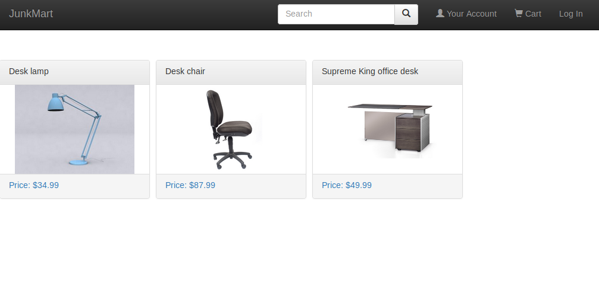
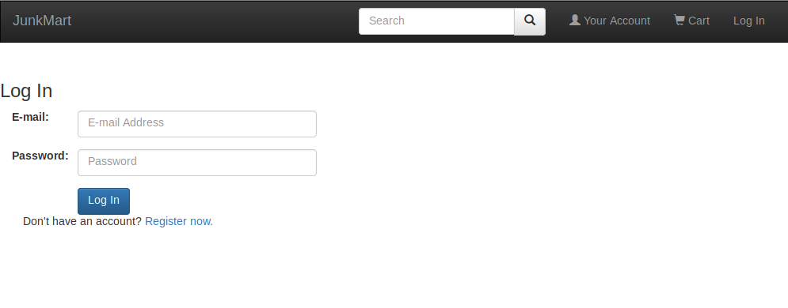
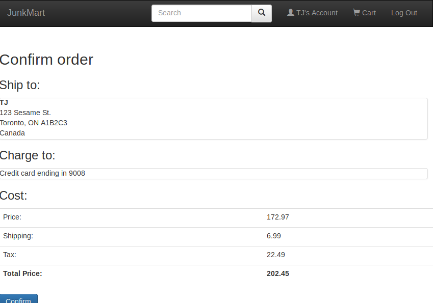
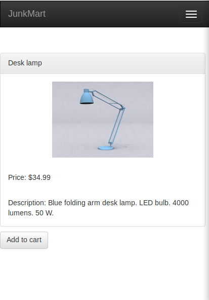

# JunkMart Store

An online shopping application for a fictional company.

## Technologies
- **node.js**
- **express**
- **pug** templates for dynamic HTML
- Session tracking using **express-session**, **node-uuid** and **bcrypt**
- **mongoose/mongoDB**
- **Bootstrap**

## Screenshots

## Setup Instructions
- Requires node, and mongodb
- Steps:
	- Start mongo service
	- run 'mongo createProducts.js'
	- run 'node main.js'
	- connect to 'localhost:3000/'
- There are no users to start off with, but they can be added using 'register now' from the login page
